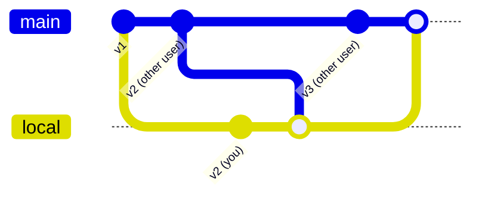

# uploadChangeset

```ts
import { uploadChangeset } from "osm-api";

await uploadChangeset(
  {
    // tags
    created_by: "iD",
    comment: "change surface to unpaved",
  },
  {
    // OsmDiff
    create: [
      /* list of `OsmFeature`s */
    ],
    modify: [],
    delete: [],
  },
  {
    // optional callbacks and options, see below for details
    onChunk: () => {},
    onAutomaticConflict: () => {},
    onManualConflict: () => {},
  }
);
```

Response:

```jsonc
{
  // 12345 is the changeset number
  "12345": {
    // the contents of this object is the diff result.
    // - for created features, this object allows you to map the temporary ID used by the uploader, to the permananet ID that the server allocated to this feature.
    // - for updated & deleted features, it includes the new version number
  },
}
```

## Detailed Examples

### Updating existing features

```ts
import { getFeature } from "osm-api";

const [feature] = await getFeature("node", 12345);

feature.tags ||= {};
feature.tags.amenity = "restaurant";

await uploadChangeset(
  { created_by: "MyApp 1.0", comment: "tagging as resturant" },
  { create: [], modify: [feature], delete: [] }
);
```

### Creating new features

To create a new node, several of the fields will have be be blanked out

```ts
import { OsmNode } from "osm-api";

const newNode: OsmNode = {
  type: "node",
  lat: 123.456,
  lon: 789.123,
  tags: {
    amenity: "restaurant",
  },
  id: -1, // Negative ID for new features

  changeset: -1,
  timestamp: "",
  uid: -1,
  user: "",
  version: 0,
};

await uploadChangeset(
  { created_by: "MyApp 1.0", comment: "created a restaurant" },
  { create: [newNode], modify: [], delete: [] }
);
```

## Note about ordering

When accessing the API directly, the order of items in `create`/`modify`/`delete` array matters.
However, if you use this library, you don't need to worry about the order.
This library will sort your changeset items before uploading it, so you send your data to this library in any order.

## Advanced Options

You typically won't need to configure these options, but they exist for advanced users:

## disableCompression

By default, uploads are compressed with [gzip](https://en.wikipedia.org/wiki/Gzip) using JavaScript's native [`CompressionStream` API](https://developer.mozilla.org/en-US/docs/Web/API/CompressionStream), if it's available.
This will marginally reduce the bandwidth used for uploads, see [openstreetmap/operations#193](https://github.com/openstreetmap/operations/issues/193) for context.
If you don't want to use gzip compression for uploads, you can set this `disableCompression` option to `false`.

### onChunk

Some changesets are too big to upload, since the API has a restriction of 10,000
features per changeset (_at the time of writing. This limit could change_).
Therefore, these changesets are intelligently split ("chunked") into multiple changesets by this library.

When this happens, you can customize the changeset tags for each chunk by specifying the `onChunk` callback.
This callback is invoked once, if your upload must be chunked.
The callback should return an object of `Tags`.

Example:

```js
await uploadChangeset(changesetTags, diff, {
  onChunk: () => {
    // this is called when the upload was chunked
    return { review_requested: "yes" }; // you can add any tags to the changeset here
  },
});
```

### onAutomaticConflict

When uploading a changeset, a [merge conflict](https://en.wikipedia.org/wiki/Edit_conflict) could occur if two users edit the same feature at the same time.

When this happens, this library might be able to automatically resolve the conflict, if the conflict is simple enough.
For example, if both users deleted the same feature, then that conflict will be automatically resolved by this library.

When an merge conflict occurs that can be automatically resolved, the library will call a callback called `onAutomaticConflict`.

The callback is invoked **for every conflicting feature**.

- If there is no callback, `onManualConflict` will be called instead
- If the callback returns `false`, then `onManualConflict` will be called instead
- If the callback returns an object, then the upload continues.
- You can optionally return an object of changeset `Tags`. If provided, then the changeset tags are updated to match the tags that you provided.

> [!NOTE]
> If you do not define `onAutomaticConflict` and do not define `onManualConflict` (see below),
> then any merge conflict will cause `uploadChangeset` to throw an error.

### onManualConflict

Some conflicts are too complicated to be automatically resolved.

For example, <kbd>you</kbd> add a tag to a feature at the same time that <kbd>other user</kbd> deletes the feature.

In this case, your code needs to decide what do to. Options include:

- keeping <kbd>you</kbd>r changes (the `local` version)
- keeping <kbd>other user</kbd>'s changes (the `remote` version)
- merging the changes automatically using your own logic.
- prompting the user to compare the diff and select who's version should be kept.

The `onManualConflict` callback is invoked if a merge conflict occurs while uploading, and that conflict is too complex to be resolved automatically by this library.

The callback is invoked **for every conflicting feature**.

- If there is no callback, then the upload fails.
- If the callback returns `false`, then the upload fails.
- If the callback returns a merged object, then that merged
  object is used.
  - You can directly return the `local` or `remote` version,
    or merge the two yourself and return the merged version.
  - You can also optionally return an object of changeset
    `Tags`. If provided, then the changeset tags are updated
    to match the tags that you provided.

> [!NOTE]
> If you do not define `onManualConflict` and do not define `onAutomaticConflict` (see above),
> then any merge conflict will cause `uploadChangeset` to throw an error.

## maxRetries

If a merge conflict occurs between <kbd>you</kbd> and <kbd>other user</kbd>, it might take <kbd>you</kbd> several minutes to resolve the conflicts using your UI.
During that time, <kbd>other user</kbd> might make more edits, and cause more conflicts.

Example:



In this example graph, <kbd>you</kbd> and <kbd>other user</kbd> both created `v2`, which is a conflict.
While <kbd>you</kbd> are resolving conflicts, <kbd>other user</kbd> has published `v3`.

&nbsp;

If this happens, the 2nd attempt to upload your changes will also fail.
Conflict resolution will need to run again, then the library will try to upload your changes for the 3rd time.

Although this case is extremely unlikely, it could theoretically continue on forever.
The option `maxRetries` specifies how many times this should be retried. By default, it is set to `3`.

### onProgress

`onProgress` is a callback function which is called whenever the upload progress changes.
It is called with an object parameter:

```js
{
    phase: "upload",
    step: 20,
    total: 35,
}
```

`step` is a number from `0` to `total` which could be used to render a progress bar.
total` might change during the upload, for example, if merge conflicts are encountered, and extra steps are required.
